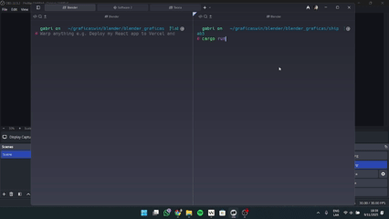

# Simulación de Estrella con Shaders

## Descripción

Este proyecto implementa una simulación realista de una estrella utilizando shaders personalizados en Rust. La animación muestra una esfera que simula la superficie turbulenta y dinámica de una estrella, con efectos de llamaradas solares, gradientes de temperatura y emisión de luz variable.

## Gif de la estrella



## Características Principales
- **Simulación de superficie estelar** usando ruido procedural
- **Efectos de turbulencia** que varían con el tiempo
- **Gradiente de temperatura** desde el núcleo (rojo intenso) hasta la corona (amarillo brillante)
- **Llamaradas solares** aleatorias con picos de intensidad
- **Pulsación cíclica** que simula la actividad estelar

## Ruido y Efectos Visuales

### Función de Ruido Personalizada
El shader utiliza una función de ruido personalizada `solar_noise` que combina múltiples funciones trigonométricas para simular la turbulencia y actividad en la superficie de la estrella. Esta función genera patrones pseudoaleatorios que varían suavemente con el tiempo.

```rust
fn solar_noise(x: f32, y: f32, z: f32, time: f32) -> f32 {
    let n1 = (x * 3.0 + time * 1.0).sin() * (y * 2.0 + time * 0.8).cos() * (z * 4.0 + time * 0.6).sin();
    let n2 = (x * 6.0 + time * 1.3).cos() * (y * 3.0 + time * 1.1).sin() * (z * 2.0 + time * 1.5).cos();
    let n3 = (x * 12.0 + time * 2.0).sin() * (y * 8.0 + time * 1.7).cos() * (z * 6.0 + time * 1.2).sin();
    
    (n1 * 0.5 + n2 * 0.3 + n3 * 0.2).abs()s
}
```

### Efectos Visuales
1. **Turbulencia Solar**:
   - Múltiples capas de ruido a diferentes escalas
   - Movimiento a diferentes velocidades para cada capa
   - Patrones dinámicos y orgánicos

2. **Gradiente de Color**:
   - **Núcleo**: Rojo intenso (1.0, 0.3, 0.1)
   - **Superficie**: Naranja (1.0, 0.6, 0.2)
   - **Corona**: Amarillo brillante (1.0, 0.9, 0.4)
   - Transiciones suaves entre zonas

3. **Efectos de Llamaradas Solares**:
   - Picos de brillo aleatorios
   - Variación temporal de la intensidad
   - Efecto de "resplandor" en las áreas más activas

4. **Pulsación Cíclica**:
   - Variación rítmica de la intensidad
   - Efecto de "latido" estelar

## Uso

1. Asegúrate de tener instalado Rust y Cargo
2. Clona el repositorio
3. Navega al directorio del proyecto
4. Ejecuta `cargo run`


## Personalización

Los parámetros de la función de ruido pueden ajustarse para lograr diferentes efectos:
- Aumentar las frecuencias para un aspecto más detallado pero más caótico
- Modificar los pesos relativos de las diferentes capas de ruido
- Ajustar la velocidad de animación modificando los factores de tiempo

## Requisitos

- Rust 1.60 o superior
- Cargo
- Dependencias especificadas en `Cargo.toml`